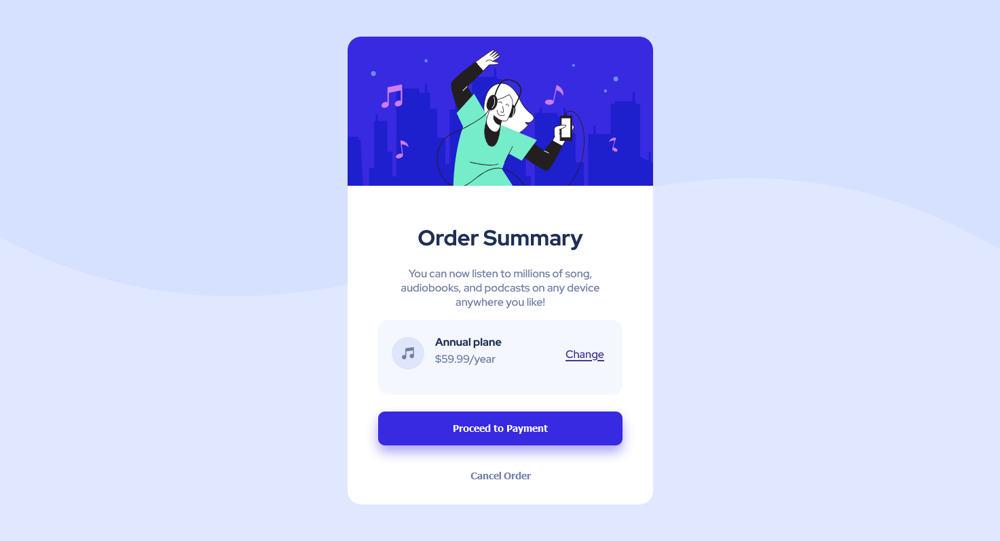
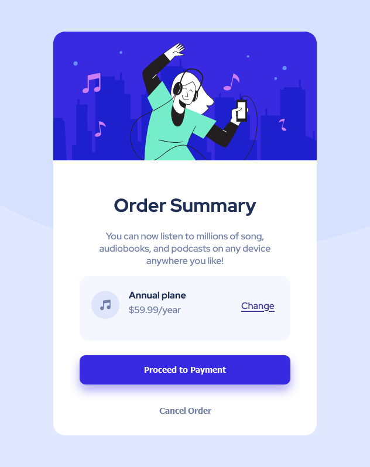
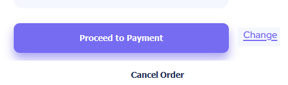

# Frontend Mentor - Order summary card solution

This is a solution to the [Order summary card challenge on Frontend Mentor](https://www.frontendmentor.io/challenges/order-summary-component-QlPmajDUj). Frontend Mentor challenges help you improve your coding skills by building realistic projects. 

## Table of contents

- [Overview](#overview)
  - [Screenshot](#screenshot)
  - [Links](#links)
- [My process](#my-process)
  - [Built with](#built-with)
  - [What I learned](#what-i-learned)

**Note: Delete this note and update the table of contents based on what sections you keep.**

## Overview

### Screenshot

### Links

- Solution URL: [Add solution URL here](https://your-solution-url.com)
- Live Site URL: [Add live site URL here](https://your-live-site-url.com)

## My process

### Built with

- Semantic HTML5 markup
- Default CSS3

**Note: These are just examples. Delete this note and replace the list above with your own choices**

### What I learned

-When "border-radius" doesn't apply, add "overflow:hidden" into the container.
-When using float, using multiple float pointing to the same direction with % width seems to work ok.
-To make a button 100% clickable, the "button" we have to apply "height: 100%" and "width: 100%" depending of the display.
-To center the content of a block with multiple block inside : "text-align: center"

